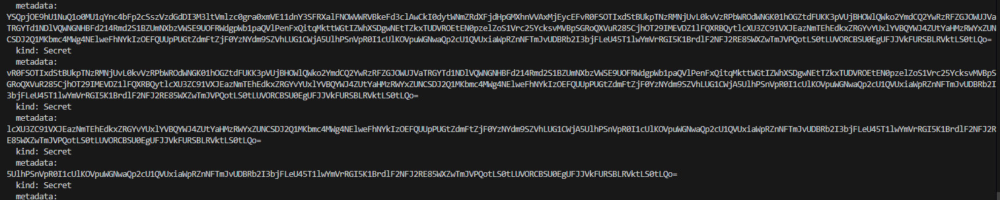

# coach19-26apr ingress controller


- Step 1: Connect to a shared EKS cluster	1  
   
 
- Step 2: Create a namespace	1  
   

- Step 3: Sample Deployment & Service	2  
    

    

    

    

- Step 4 (Optional): Testing your service using Netshoot

  
```
apiVersion: v1
kind: Pod
metadata:
  name: netshoot
  namespace: chrisy-eks-activity
spec:
  containers:
  - name: netshoot
    image: nicolaka/netshoot:latest
    command: ["/bin/bash"]
    args: ["-c", "while true; do ping localhost; sleep 60;done"]
```
  
- Step 4: Creating a Ingress Resource with ExternalDNS & Nginx Controller  
  
- Step 5: Verify record creation in Route53  
    

    

- Step 6: Enable LetsEncrypt TLS cert on your Ingress  

  

```
apiVersion: networking.k8s.io/v1
kind: Ingress
metadata:
  name: chrisy-echo-app-ingress
  namespace: chrisy-eks-activity
  annotations:
    cert-manager.io/cluster-issuer: "letsencrypt-prod" # <----- appended
    external-dns.alpha.kubernetes.io/hostname: "chrisy-echoapp.sctp-sandbox.com" # Route53 Record
spec:
  ingressClassName: nginx
  tls:
    - hosts:
        - "chrisy-echoapp.sctp-sandbox.com" # Route53 Record
      secretName: chrisy-tls  # <----- appended
  rules:
  - host: "chrisy-echoapp.sctp-sandbox.com" # Route53 Record
    http:
      paths:
      - path: /
        pathType: Prefix
        backend:
          service:
            name: chrisy-echo-service
            port:
              number: 80
```
  
  
- Step 7: Curl your HTTPS endpoint  

  

  

  

  

  
